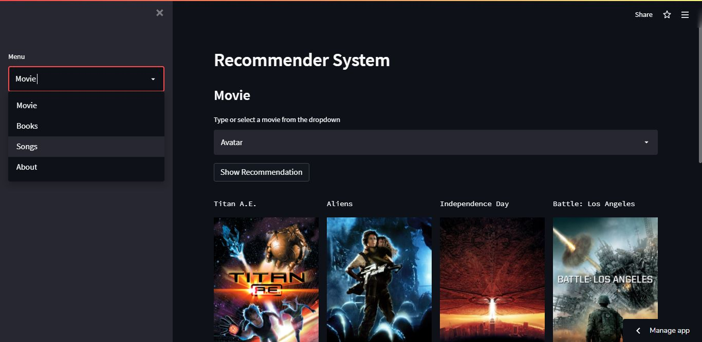

# Build with

# Recommender

A web App deployed on HEROKU CLOUD/Strealit CLoud ,that recommends MOVIES, SONGS and BOOKS

### What are Recommendation systems

Recommender systems are the systems that are designed to recommend things to the user based on many different factors. These systems predict the most likely product that the users are most likely to purchase and are of interest to. Companies like Netflix, Amazon, etc. use recommender systems to help their users to identify the correct product or movies for them. 

The recommender system deals with a large volume of information present by filtering the most important information based on the data provided by a user and other factors that take care of the user’s preference and interest. It finds out the match between user and item and imputes the similarities between users and items for recommendation. 

### Project overview
In this project ,we have designed a recommendation system that recommends MOVIES, SONGS and BOOKS based on the input given by the user, this is a contenct based recommendation system.
This system also shows Details of the recommended output .In this system the recommender is made by using Cosine Similarity function

### Datasets Used

Below are the links used to train the Recommender model

Movie dataset :- 'https://www.kaggle.com/datasets/tmdb/tmdb-movie-metadata'

Book dataset :- 'https://zenodo.org/record/4265096'

Song dataset :- 'https://www.kaggle.com/datasets/saurabhshahane/spotgen-music-dataset'

### Deployment 
This app can be deployed on Heroku Cloud and also Streamlit Cloud , this repo contains all the necessary files for deployment

### What is Cosine Similarity?

Mathematically Cosine similarity measures the similarity between two vectors of an inner product space. It is measured by the cosine of the angle between two vectors and determines whether two vectors are pointing in roughly the same direction. It is often used to measure document similarity in text analysis.

In Python the cosine similarity measures the similarity between vector lists by calculating the cosine angle between the two vector lists. If you consider the cosine function, its value at 0 degrees is 1 and -1 at 180 degrees. This means for two overlapping vectors, the value of cosine will be maximum and minimum for two precisely opposite vectors.

You can get more information about cosine Similarity [here.](https://www.delftstack.com/howto/python/cosine-similarity-between-lists-python/#use-the-scipy-module-to-calculate-the-cosine-similarity-between-two-lists-in-python)

